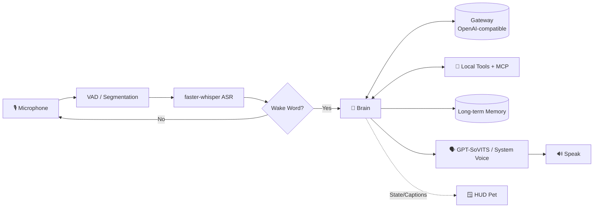

# 🚀 ZetaJarvis - Your Personal Iron Man AI Assistant

<p align="center">
  
</p>

[](https://github.com/sachin-saroj)
[](./LICENSE)

**ZetaJarvis** is a fully offline-capable, voice-controlled AI assistant built for Windows and macOS. Forked from HoloJarvis and heavily customized for Indian users, it supports Hinglish auto-detection, WhatsApp integration, regional Google Search, and Indian weather lookups. It features a beautiful, floating holographic desktop HUD inspired by Iron Man's JARVIS interface.

---

## ✨ Features

- 🎤 **Voice Wake Word** — Wake the assistant hands-free by saying "Jarvis" or "Alpha". Built-in phonetic variations (like "jarvees", "zarvis", "alfa") ensure high accuracy even with Whisper misspellings.
- 🧠 **Local & Cloud LLMs** — Fully supports local LLMs (via Ollama) or cloud engines (via OpenRouter/DeepSeek/GPT) using any OpenAI-compatible gateway.
- 🌍 **Hinglish & English Bilingual Support** — Auto-detects speech input language seamlessly, allowing you to code-switch and talk naturally using Hinglish.
- 🔧 **MCP Tools Integration** — Dynamically load Model Context Protocol (MCP) servers alongside local tools to manage files, browsers, and terminal interactions.
- 📱 **WhatsApp Integration** — Send messages to WhatsApp contacts using Meta's WhatsApp Cloud API or fall back to native Windows UI automation.
- 🖥️ **Desktop Pet & GUI HUD** — A borderless, always-on-top HUD floating panel showing real-time time/date, weather, system telemetry (Disk/Battery/CPU), conversation log, and notes panel. Click the arc reactor core to talk.
- 🗣️ **Cloned Voice Support** — Connect local GPT-SoVITS instances to speak responses in your own cloned voice, falling back to offline Windows SAPI (pyttsx3) when offline.

---

## 🏗️ Architecture



---

## 🛠️ Setup & Installation

### Prerequisites
- **Python 3.10 to 3.12** (runtime enforced).
- **PortAudio** (System library required for `sounddevice` audio recording):
  - **Windows**: Bundled automatically.
  - **macOS**: Install via Homebrew: `brew install portaudio` before running `pip install`.
- **Node.js & npm** (Required only if you enable Node-based MCP tools like the default filesystem server).
- **Local Speech SAPI/say Voice**: Ensure you have an English/Hindi voice pack installed in Windows settings under *Time & language → Speech* (e.g., Zira or David for English, Heera for Hindi).

### Step-by-Step Setup
1. **Clone the repository:**
   ```bash
   git clone https://github.com/sachin-saroj/zetajarvis.git
   cd zetajarvis
   ```

2. **Set up a Python virtual environment:**
   ```bash
   python -m venv .venv
   ```

3. **Activate the virtual environment & install dependencies:**
   - **Windows:**
     ```powershell
     .venv\Scripts\activate
     pip install -r requirements.txt
     ```
   - **macOS/Linux:**
     ```bash
     source .venv/bin/activate
     pip install -r requirements.txt
     ```

4. **Configure environment variables:**
   - Copy `.env.example` to `.env`:
     - **Windows:** `copy .env.example .env`
     - **macOS/Linux:** `cp .env.example .env`
   - Edit `.env` and fill in your OpenAI-compatible API gateway URL and API keys (e.g., OpenRouter or Ollama). Default TTS is set to system `say` for instant out-of-the-box operation.

5. **Start ZetaJarvis:**
   - **With desktop HUD (GUI):**
     ```bash
     python -m jarvis
     ```
   - **Headless (CLI only):**
     ```bash
     python -m jarvis --no-pet
     ```

---

## 🗣️ Voice Customization & Advanced Setup

### Default TTS Backend (Out-of-the-box)
By default, `JARVIS_TTS` is configured to `say` in `.env`. This utilizes the built-in operating system speech engines (SAPI/pyttsx3 on Windows, `say` on macOS) for zero-configuration, instant voice synthesis.

### Cloned Voice (GPT-SoVITS Integration)
For advanced, few-shot voice cloning, you can connect a self-hosted GPT-SoVITS server:
1. Deploy [GPT-SoVITS](https://github.com/RVC-Boss/GPT-SoVITS) and start its `api_v2` listening on `127.0.0.1:9880`.
2. Place a reference `.wav` file (e.g. `jarvis_ref.wav`) in the project root.
3. Configure your `.env`:
   ```env
   JARVIS_TTS=gptsovits
   GPTSOVITS_URL=http://127.0.0.1:9880
   GPTSOVITS_REF=jarvis_ref.wav
   GPTSOVITS_PROMPT="The exact sentence spoken in the reference wav clip."
   ```
4. Restart ZetaJarvis. If the GPT-SoVITS server is unreachable, the system will automatically fall back to the default OS voice engine.

---

## 🧰 Built-in Tools

| Tool | Action | Description |
|---|---|---|
| `open_app` / `open_url` | System | Opens desktop applications or links in the browser |
| `web_search` | Web | Runs regional Google searches (localized for India) |
| `get_time` / `get_weather` | Utility | Current local time and weather lookup |
| `control_music` / `set_volume`| System | Control media players and system volume |
| `set_timer` | Utility | Voice-activated timer reminder |
| `take_screenshot` / `read_screen`| Vision | Captures active screen and sends it to LLM for summary/queries |
| `send_whatsapp` | Message | Sends WhatsApp messages via Cloud API or UI automation |
| `system_power` | System | Lock screen or prepare computer for sleep |
| `remember` / `forget` | Memory | Add/remove user facts to long-term memory (`memory.json`) |
| `list_directory` / `run_shell` | Command | Navigate folders and run shell/PowerShell commands. **(Warning: Not sandboxed. Use with caution)** |

---

## 📜 License

MIT License. Original codebase copyright (c) 2024 wqq64842.
Modified, optimized for Windows/India, and maintained by Sachin Saroj (c) 2026. See [LICENSE](./LICENSE) for full details.
