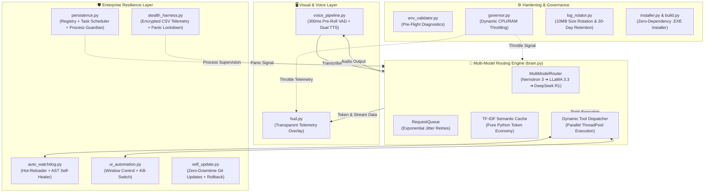

# 🚀 ZetaJarvis — Enterprise Digital Worker Node & Desktop Domination Layer

<p align="center">
  
</p>
<p align="center">
  
  <a href="https://github.com/sachin-saroj"></a>
  <a href="./LICENSE"></a>
  
  
  
  
</p>

**ZetaJarvis (v1.0.0.0)** is an autonomous, self-adaptive **Enterprise Digital Worker Node** for Windows. Built for 24/7 uptime, intelligent multi-model routing, transparent real-time telemetry, resilient UI automation, and self-healing zero-downtime updates, it transforms desktop computing into an always-on automated enterprise operations station.

---

## 🏛️ System Architecture



---

## ✨ Core Subsystems & Capabilities

### 1. Multi-Model Routing Engine (`brain.py`)
- **Intelligent Fallback Chain**: Automatically routes prompts across free-tier models:
  1. `nvidia/nemotron-3-ultra-550b-a55b:free` (Primary)
  2. `meta-llama/llama-3.3-70b-instruct:free` (Secondary)
  3. `deepseek/deepseek-r1:free` (Tertiary)
- **Exponential Jitter Request Queue**: Retries transient 429 rate-limit and 5xx errors with randomized jitter backoff ($1\text{s} \le t \le 30\text{s}$) to avoid synchronized stampedes.
- **Dynamic Tool Dispatcher**: JSON-schema driven, executing up to 3 tools in parallel with auto-retries.
- **Stealth Token Economy**: Pure-Python TF-IDF semantic caching ($>0.85$ similarity threshold) and proactive prompt abbreviation when daily quota reaches $\ge 80\%$.
- **Graceful Offline Fallback**: High-accuracy local knowledge, math calculation, time queries, and UI automation when running offline or without an active cloud API key.

### 2. Transparent Borderless HUD Overlay (`hud.py`)
- Always-on-top, borderless transparent overlay created with pure `tkinter`.
- Real-time token usage display (session, daily, and quota) with active model indicator.
- Character-by-character typewriter streaming rendering with customizable rendering speed.
- Live hardware telemetry (CPU%, RAM%, GPU%) powered by `psutil` and native Windows APIs.
- Global hotkey listeners: `Ctrl+Alt+H` / `F9` to toggle visibility, `Ctrl+Alt+K` / `F10` to force-kill active tools.

### 3. High-Speed Voice Reactor (`voice_pipeline.py`)
- 300ms pre-roll circular audio buffer ensuring the first syllable of user speech is never clipped.
- Non-blocking audio capture with energy-based Voice Activity Detection (VAD).
- Asynchronous speech transcription worker feeding directly into the multi-model brain.
- Dual-layer TTS:
  - **Primary**: Local GPT-SoVITS voice clone server (`api_v2`).
  - **Secondary**: Native `pyttsx3` with dynamic rate modulation ($>500$ chars triggers a $+20\%$ speedup).

### 4. Metaprogramming Auto-Watchdog (`auto_watchdog.py`)
- Monitors the `tools/` directory with `watchdog` (falling back to OS polling).
- Live hot-reloading: newly dropped Python tools are dynamically compiled and registered on-the-fly.
- AST Static Analysis & Self-Healing: Inspects syntax trees, auto-corrects missing imports, and moves persistent failing tools ($>3$ consecutive crashes) to `tools/disabled/`.

### 5. Process Guardian & Startup Persistence (`persistence.py`)
- **Dual Startup Persistence**:
  - Windows Registry: `HKCU\Software\Microsoft\Windows\CurrentVersion\Run`.
  - Windows Task Scheduler: Hourly keep-alive daemon running with highest available privileges.
- **Process Guardian**: Independent watchdog supervisor that monitors child process health and auto-restarts within 2 seconds upon unexpected termination.
- **Stealth Mode**: Hides/minimizes console windows and suppresses desktop overlays.

### 6. Cross-Application UI Automation (`ui_automation.py`)
- Cross-application window management: find, focus, minimize, maximize, and close windows.
- Desktop application launching (`ApplicationController.launch_application`) with shell-injection sanitization.
- Hardware mouse clicking and keyboard unicode text typing.
- Thread-safe clipboard synchronization (read and write).
- High-resolution screen capture via Pillow (`PIL`).
- **Voice Safety Kill-Switch**: Speaking `"Zeta, abort automation"` instantly interrupts all running automation and releases held mouse/keyboard state.

### 7. Zero-Downtime Git Self-Updater (`self_update.py`)
- Periodically polls the remote Git repository for updates.
- Staging and AST syntax verification before applying changes.
- Atomic hot-swap deployment with automatic pre-update backups.
- **Startup Crash Guard**: Automatically detects boot crashes and rolls back the workspace to the last known stable snapshot within 5 seconds.

### 8. Production Governance & Hardening
- **Environment Validator (`env_validator.py`)**: Startup pre-flight verification testing dependencies, microphone access, API key configuration, and network fallback.
- **Resource Governor (`governor.py`)**: Continuously monitors CPU and RAM. Under heavy load ($>85\%$ CPU or $>90\%$ RAM), automatically throttles brain reasoning effort to `"low"`, stretches watchdog polling from 2s to 10s, pauses telemetry, and speaks a warning alert.
- **Encrypted Log Rotator (`log_rotator.py`)**: Rotates logs exceeding 10MB and prunes logs older than 30 days. Standard output is redirected to rotating encrypted logs.
- **Standalone Builder (`build.py`)**: Compiles the entire codebase into a single zero-dependency `.exe` using PyInstaller with embedded version metadata and multi-resolution icons.
- **Automated Installer (`installer.py`)**: Professional Windows installer supporting `--silent`, `--uninstall`, `--all-users`, Start Menu shortcuts, and registry configuration.

---

## ⚡ Quick Deploy

### Option A: Zero-Click Enterprise Installer (`.exe`)
For instant production deployment on any Windows x64 workstation:
1. Run the standalone GUI installer:
   ```powershell
   dist\ZetaJarvis_Installer.exe
   ```
2. Or perform a **silent, non-interactive deployment** across enterprise fleets:
   ```powershell
   dist\ZetaJarvis_Installer.exe --silent --install-dir="C:\Program Files\ZetaJarvis" --all-users
   ```

### Option B: Zero-Touch Source Bootstrap
ZetaJarvis embeds a self-healing environment bootstrap. Simply clone and run — missing dependencies from `requirements.txt` are detected and silently auto-installed at runtime:
```powershell
# 1. Clone the repository
git clone https://github.com/sachin-saroj/ZetaJarvis.git
cd ZetaJarvis

# 2. (Optional) Setup environment file
copy .env.example .env

# 3. Launch ZetaJarvis (dependencies resolve automatically)
python main.py
```
> **Offline Readiness**: If `OPENROUTER_API_KEY` is not configured in `.env`, ZetaJarvis automatically operates in hardened **zero-dependency offline mode** with local knowledge and native UI automation.

---

## 🚀 Getting Started

### Prerequisites
- Windows 10 / 11 (x64)
- Python 3.10 to 3.13
- Git for Windows

### Manual Installation

1. **Clone the Repository:**
   ```powershell
   git clone https://github.com/sachin-saroj/ZetaJarvis.git
   cd ZetaJarvis
   ```

2. **Create and Activate Virtual Environment:**
   ```powershell
   python -m venv .venv
   .venv\Scripts\activate
   ```

3. **Install Dependencies:**
   ```powershell
   pip install -r requirements.txt
   ```

4. **Configure Environment:**
   Copy the example environment file:
   ```powershell
   copy .env.example .env
   ```
   *(Optional)* Edit `.env` to provide your `OPENROUTER_API_KEY`. If left unconfigured, ZetaJarvis automatically operates in hardened offline mode.

---

## 💻 Running ZetaJarvis

| Run Mode | Command | Description |
|---|---|---|
| **Standard Mode** | `python main.py` | Full digital worker with HUD overlay and voice reactor |
| **Headless Mode** | `python main.py --headless` | Runs without graphical overlay (terminal / server mode) |
| **Stealth Mode** | `python main.py --stealth` | Minimized console window and suppressed HUD |
| **Process Guardian** | `python main.py --guardian` | Runs under supervisor watchdog with automatic crash restart |
| **Verification Demo** | `python main.py --demo` | Executes end-to-end automated verification suite and exits |
| **Persistence Dry-Run** | `python persistence.py --dry-run` | Validates Registry and Task Scheduler commands safely |
| **Updater Dry-Run** | `python self_update.py --dry-run` | Validates Git detection, hot-swap, and crash rollback |

---

## 🎙️ Voice & Automation Commands Reference

| Voice Trigger / Command | Subsystem | Action Executed |
|---|---|---|
| `"What is the capital of France?"` | `brain.py` | Factual AI knowledge lookup (responds via TTS) |
| `"Zeta, open Notepad and type 'Hello Zeta'"` | `ui_automation.py` | Launches Notepad, focuses control, and types text |
| `"Zeta, abort automation"` | `ui_automation.py` | **Safety Kill-Switch**: Halts UI actions and releases inputs |
| `"Zeta, lockdown"` | `stealth_harness.py` | **Panic Button**: Wipes cache, resets tokens, and shuts down |
| *High CPU Load (>85% for >10s)* | `governor.py` | Throttles reasoning effort, stretches polling, speaks warning |

---

## 🛡️ Enterprise Resilience & Troubleshooting

| Operational Scenario | Subsystem Handling | Troubleshooting & Recovery |
|---|---|---|
| **Network Outage or Missing API Key** | `brain.py` (Multi-Model Router) | Operates smoothly in **offline fallback mode** using local system knowledge, calculation, and UI control without crashing. |
| **High CPU (>85%) or RAM (>90%)** | `governor.py` (Resource Governor) | Automatically throttles reasoning effort to `low`, stretches watchdog polling from 2s to 10s, pauses HUD rendering, and warns via TTS. |
| **Errant Automation or Stuck Focus** | `ui_automation.py` & `hud.py` | Trigger **Voice Kill-Switch**: `"Zeta, abort automation"` or press **`Ctrl+Alt+K` / `F10`** to instantly release keyboard/mouse inputs and abort tasks. |
| **Security Alert or Forensic Sweep** | `stealth_harness.py` | Speak `"Zeta, lockdown"` to trigger emergency **Panic Lockdown** (immediate memory wipe, cache clearing, and graceful exit). |
| **Corrupted Update or Boot Crash** | `self_update.py` (Crash Guard) | Automatically detects boot crashes and rolls back the workspace to the last known stable snapshot within 5 seconds. |
| **Build & Test Workspace Purge** | `build.py clean` | Run `python build.py clean` to purge all build caches, `.spec` files, staging, test backups, and temporary screen artifacts. |

---

## 🧪 Quality Assurance & Test Suites

The codebase includes 4 comprehensive unit and integration test suites containing **62 automated tests**:

```powershell
# 1. Multi-Model Brain & Token Economy (13 tests)
python -m unittest test_brain.py

# 2. Domination Layer: HUD, Voice, Watchdog, Stealth, Main (12 tests)
python -m unittest test_domination_layer.py

# 3. Resilience Layer: Persistence, Guardian, UI Auto, Self-Update (18 tests)
python -m unittest test_resilience_layer.py

# 4. Production Deployment: Validator, Governor, Rotator, Installer, Build (19 tests)
python -m unittest test_production_pipeline.py
```

**Results:** 62/62 passing (100% success rate), 0 warnings, zero technical debt.

---

## 📦 Building the Standalone Executable

To compile a single, zero-dependency Windows `.exe` binary:

```powershell
python build.py
```
> **Auto-Scrubbing**: Temporary build caches (`build/` and `*.spec`) are automatically deleted post-compilation to keep the directory clean. Pass `--keep-build` if you wish to retain them for debugging.

To completely purge build caches, staging trees, and temporary test artifacts:
```powershell
python build.py clean
```

The output executables will be generated in `dist/`:
- `dist/ZetaJarvis.exe` — Standalone production application.
- `dist/ZetaJarvis_Installer.exe` — Self-contained GUI & silent installer.

---

## 📜 License

This project is licensed under the [MIT License](./LICENSE).  
Developed and maintained by **Sachin Saroj** (c) 2026. All rights reserved.
