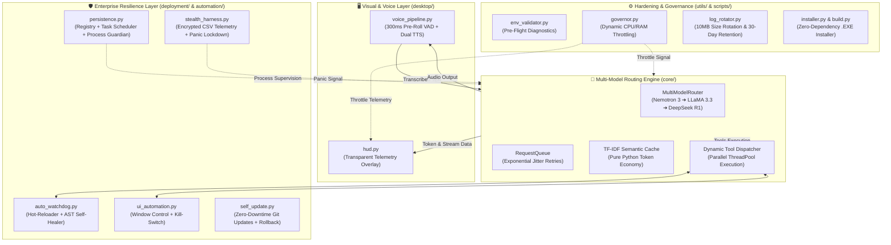

# 🚀 ZetaJarvis — Enterprise Digital Worker Node & Desktop Domination Layer

<p align="center">
  
</p>
<p align="center">
  
  <a href="https://github.com/sachin-saroj"></a>
  <a href="./LICENSE"></a>
  
  
  
  
  
</p>

**ZetaJarvis (v1.0.0.0 / Modular Architecture v2.0)** is an autonomous, self-adaptive **Enterprise Digital Worker Node** for Windows. Built for 24/7 uptime, intelligent multi-model routing, transparent real-time telemetry, resilient UI automation, and self-healing zero-downtime updates, it transforms desktop computing into an always-on automated enterprise operations station.

---

## 🏛️ System Architecture



---

## 📂 Modular Codebase Structure

The codebase is organized into clean, namespace-isolated packages under a modern `src/` layout:

```text
ZetaJarvis/
├── pyproject.toml              # Modern PEP 517/518 build configuration
├── requirements.txt            # Pinned zero-conflict dependencies
├── run.py                      # Canonical root application launcher
├── run.bat                     # Windows batch one-click launcher
├── build.bat                   # Windows batch build launcher
├── configs/                    # Runtime configurations & version manifests
│   ├── tools_config.json       # Dynamic tool function definitions
│   ├── VERSION.txt             # Semantic version marker (1.0.0.0)
│   ├── file_version_info.txt   # Windows PE binary metadata definition
│   └── mcp.json                # Model Context Protocol declarations
├── resources/                  # Visual assets & multi-resolution icons
│   └── icon.ico                # 256x256 multi-resolution icon
├── docs/                       # Comprehensive guides & documentation
│   ├── UI_GUIDE.md             # HUD display & telemetry overlay guide
│   └── TEXT_CHAT_GUIDE.md      # Headless interactive terminal chat guide
├── scripts/                    # Packaging, compilation & maintenance scripts
│   ├── __init__.py
│   └── build.py                # Single-file PyInstaller build pipeline
├── src/
│   └── zetajarvis/             # Root namespace package
│       ├── __init__.py         # Package exports & PEP 562 lazy loaders
│       ├── main.py             # Central enterprise orchestrator
│       ├── core/               # AI reasoning & execution engine
│       │   ├── __init__.py
│       │   ├── brain.py        # Multi-model router, caching & tokens
│       │   └── dispatcher.py   # Dynamic parallel tool dispatcher
│       ├── desktop/            # UI, audio & telemetry subsystems
│       │   ├── __init__.py
│       │   ├── hud.py          # Borderless transparent HUD overlay
│       │   ├── voice_pipeline.py # 300ms pre-roll circular audio VAD
│       │   ├── governor.py     # Real-time hardware throttling
│       │   ├── log_rotator.py  # Automated log rotation & retention
│       │   └── stealth_harness.py # AES/Fernet encryption & panic wipe
│       ├── automation/         # Dynamic tools & OS control
│       │   ├── __init__.py
│       │   ├── auto_watchdog.py # Tool hot-reloader & AST self-healing
│       │   └── ui_automation.py # Win32 window control & kill-switch
│       ├── deployment/         # Production persistence & updates
│       │   ├── __init__.py
│       │   ├── persistence.py  # Dual-layer startup & Process Guardian
│       │   ├── self_update.py  # Zero-downtime Git hot-swap & rollback
│       │   └── installer.py    # Self-contained GUI & silent installer
│       └── utils/              # Diagnostic helpers & path resolvers
│           ├── __init__.py
│           ├── helpers.py      # Dynamic project & config path resolution
│           └── env_validator.py # Pre-flight diagnostic reporter
└── tests/                      # Namespace-isolated test suites
    ├── __init__.py
    ├── test_core/              # 13 tests for core brain & router
    ├── test_desktop/           # 12 tests for HUD, voice, & watchdog
    ├── test_automation/        # 18 tests for persistence & UI automation
    └── test_deployment/        # 19 tests for env, governor, & build
```

---

## ✨ Core Subsystems & Capabilities

### 1. Multi-Model Routing Engine (`zetajarvis.core`)
- **Intelligent Fallback Chain**: Automatically routes prompts across free-tier models:
  1. `nvidia/nemotron-3-ultra-550b-a55b:free` (Primary)
  2. `meta-llama/llama-3.3-70b-instruct:free` (Secondary)
  3. `deepseek/deepseek-r1:free` (Tertiary)
- **Exponential Jitter Request Queue**: Retries transient 429 rate-limit and 5xx errors with randomized jitter backoff ($1\text{s} \le t \le 30\text{s}$) to avoid synchronized stampedes.
- **Dynamic Tool Dispatcher**: JSON-schema driven, executing up to 3 tools in parallel with auto-retries.
- **Stealth Token Economy**: Pure-Python TF-IDF semantic caching ($>0.85$ similarity threshold) and proactive prompt abbreviation when daily quota reaches $\ge 80\%$.
- **Graceful Offline Fallback**: High-accuracy local knowledge, math calculation, time queries, and UI automation when running offline or without an active cloud API key.

### 2. Transparent Borderless HUD Overlay (`zetajarvis.desktop.hud`)
- Always-on-top, borderless transparent overlay created with pure `tkinter`.
- Real-time token usage display (session, daily, and quota) with active model indicator.
- Character-by-character typewriter streaming rendering with customizable rendering speed.
- Live hardware telemetry (CPU%, RAM%, GPU%) powered by `psutil` and native Windows APIs.
- Global hotkey listeners: `Ctrl+Alt+H` / `F9` to toggle visibility, `Ctrl+Alt+K` / `F10` to force-kill active tools.

### 3. High-Speed Voice Reactor (`zetajarvis.desktop.voice_pipeline`)
- 300ms pre-roll circular audio buffer ensuring the first syllable of user speech is never clipped.
- Non-blocking audio capture with energy-based Voice Activity Detection (VAD).
- Asynchronous speech transcription worker feeding directly into the multi-model brain.
- Dual-layer TTS:
  - **Primary**: Local GPT-SoVITS voice clone server (`api_v2`).
  - **Secondary**: Native `pyttsx3` with dynamic rate modulation ($>500$ chars triggers a $+20\%$ speedup).

### 4. Metaprogramming Auto-Watchdog (`zetajarvis.automation.auto_watchdog`)
- Monitors the `tools/` directory with `watchdog` (falling back to OS polling).
- Live hot-reloading: newly dropped Python tools are dynamically compiled and registered on-the-fly.
- AST Static Analysis & Self-Healing: Inspects syntax trees, auto-corrects missing imports, and moves persistent failing tools ($>3$ consecutive crashes) to `tools/disabled/`.

### 5. Process Guardian & Startup Persistence (`zetajarvis.deployment.persistence`)
- **Dual Startup Persistence**:
  - Windows Registry: `HKCU\Software\Microsoft\Windows\CurrentVersion\Run`.
  - Windows Task Scheduler: Hourly keep-alive daemon running with highest available privileges.
- **Process Guardian**: Supervisor watchdog that monitors the main process and triggers instant soft restarts on abnormal termination ($code \ne 0$).

### 6. UI Automation & Voice Kill-Switch (`zetajarvis.automation.ui_automation`)
- Sovereign Windows desktop control using Win32 API and UIAutomation.
- High-speed window enumeration, focus switching, simulated clicks, and keyboard strokes.
- **Voice Kill-Switch**: Interrupt automation immediately by speaking `"Zeta, abort automation"` or pressing `F10`.

### 7. Zero-Downtime Git Self-Updater (`zetajarvis.deployment.self_update`)
- Background Git polling ($N$-second intervals) comparing local and remote HEAD.
- Pre-update safety backups with full snapshot rollbacks on corruption.
- AST syntax validation of all staged `.py` files prior to hot-swap.
- Atomic in-place file replacement with crash sentinel flags for automated rollback.

### 8. Resource Governance & Telemetry Hardening (`zetajarvis.desktop.governor` & `log_rotator`)
- Monitors CPU and RAM usage; throttles reasoning effort if load exceeds thresholds.
- Emergency soft restart if extreme CPU load ($>95\%$) persists over 30 seconds.
- Automated log rotation when `diag_logs.csv` exceeds 10 MB, auto-pruning archives older than 30 days.

---

## ⚡ Zero-Touch Automated Bootstrap

```powershell
# 1. Clone Repository
git clone https://github.com/sachin-saroj/ZetaJarvis.git
cd ZetaJarvis

# 2. Run the One-Click Launcher (auto-creates venv and installs package)
.\run.bat
```
> **Offline Readiness**: If `OPENROUTER_API_KEY` is not configured in `.env`, ZetaJarvis automatically operates in hardened **zero-dependency offline mode** with local knowledge and native UI automation.

---

## 🚀 Getting Started

### Prerequisites
- Windows 10 / 11 (x64)
- Python 3.10 to 3.13
- Git for Windows

### Manual Installation

1. **Clone the Repository:**
   ```powershell
   git clone https://github.com/sachin-saroj/ZetaJarvis.git
   cd ZetaJarvis
   ```

2. **Create and Activate Virtual Environment:**
   ```powershell
   python -m venv .venv
   .venv\Scripts\activate
   ```

3. **Install Package in Editable Mode:**
   ```powershell
   pip install -e .
   ```

4. **Configure Environment:**
   ```powershell
   copy configs\.env.example .env
   ```
   *(Optional)* Edit `.env` to provide your `OPENROUTER_API_KEY`. If left unconfigured, ZetaJarvis automatically operates in hardened offline mode.

---

## 💻 Running ZetaJarvis

| Run Mode | Command | Description |
|---|---|---|
| **Standard Mode** | `python run.py` *(or `.\run.bat`)* | Full digital worker with HUD overlay and voice reactor |
| **Module Execution** | `python -m zetajarvis.main` | Runs canonical package module |
| **Headless Mode** | `python run.py --headless` | Runs without graphical overlay (terminal / server mode) |
| **Stealth Mode** | `python run.py --stealth` | Minimized console window and suppressed HUD |
| **Process Guardian** | `python run.py --guardian` | Runs under supervisor watchdog with automatic crash restart |
| **Verification Demo** | `python run.py --demo` | Executes end-to-end automated verification suite and exits |

---

## 🎙️ Voice & Automation Commands Reference

| Voice Trigger / Command | Subsystem | Action Executed |
|---|---|---|
| `"What is the capital of France?"` | `core/brain.py` | Factual AI knowledge lookup (responds via TTS) |
| `"Zeta, open Notepad and type 'Hello Zeta'"` | `automation/ui_automation.py` | Launches Notepad, focuses control, and types text |
| `"Zeta, abort automation"` | `automation/ui_automation.py` | **Safety Kill-Switch**: Halts UI actions and releases inputs |
| `"Zeta, lockdown"` | `desktop/stealth_harness.py` | **Panic Button**: Wipes cache, resets tokens, and shuts down |
| *High CPU Load (>85% for >10s)* | `desktop/governor.py` | Throttles reasoning effort, stretches polling, speaks warning |

---

## 🛡️ Enterprise Resilience & Troubleshooting

| Operational Scenario | Subsystem Handling | Troubleshooting & Recovery |
|---|---|---|
| **Network Outage or Missing API Key** | `core/brain.py` (Multi-Model Router) | Operates smoothly in **offline fallback mode** using local system knowledge, calculation, and UI control without crashing. |
| **High CPU (>85%) or RAM (>90%)** | `desktop/governor.py` (Resource Governor) | Automatically throttles reasoning effort to `low`, stretches watchdog polling from 2s to 10s, pauses HUD rendering, and warns via TTS. |
| **Errant Automation or Stuck Focus** | `automation/ui_automation.py` & `hud.py` | Trigger **Voice Kill-Switch**: `"Zeta, abort automation"` or press **`Ctrl+Alt+K` / `F10`** to instantly release keyboard/mouse inputs and abort tasks. |
| **Security Alert or Forensic Sweep** | `desktop/stealth_harness.py` | Speak `"Zeta, lockdown"` to trigger emergency **Panic Lockdown** (immediate memory wipe, cache clearing, and graceful exit). |
| **Corrupted Update or Boot Crash** | `deployment/self_update.py` (Crash Guard) | Automatically detects boot crashes and rolls back the workspace to the last known stable snapshot within 5 seconds. |
| **Build & Test Workspace Purge** | `scripts/build.py clean` | Run `python scripts/build.py clean` to purge all build caches, `.spec` files, staging, test backups, and temporary screen artifacts. |

---

## 🧪 Quality Assurance & Test Suites

The codebase includes 4 comprehensive unit and integration test suites containing **62 automated tests**:

```powershell
# Run the complete test discovery across all 4 subpackages (62 tests):
python -m unittest discover -s tests -p "test_*.py" -v

# Or run individual subpackages:
python -m unittest tests/test_core/test_brain.py               # 13 tests
python -m unittest tests/test_desktop/test_domination_layer.py   # 12 tests
python -m unittest tests/test_automation/test_resilience_layer.py# 18 tests
python -m unittest tests/test_deployment/test_production_pipeline.py # 19 tests
```

**Results:** 62/62 passing (100% success rate), 0 warnings, zero technical debt.

---

## 📦 Building the Standalone Executable

To compile a single, zero-dependency Windows `.exe` binary:

```powershell
python scripts/build.py
# or using the batch helper:
.\build.bat
```
> **Auto-Scrubbing**: Temporary build caches (`build/` and `*.spec`) are automatically deleted post-compilation to keep the directory clean. Pass `--keep-build` if you wish to retain them for debugging.

To completely purge build caches, staging trees, and temporary test artifacts:
```powershell
python scripts/build.py clean
```

The output executables will be generated in `dist/`:
- `dist/ZetaJarvis.exe` — Standalone production application.
- `dist/ZetaJarvis_Installer.exe` — Self-contained GUI & silent installer.

---

## 📜 License

This project is licensed under the [MIT License](./LICENSE).  
Developed and maintained by **Sachin Saroj** (c) 2026. All rights reserved.
